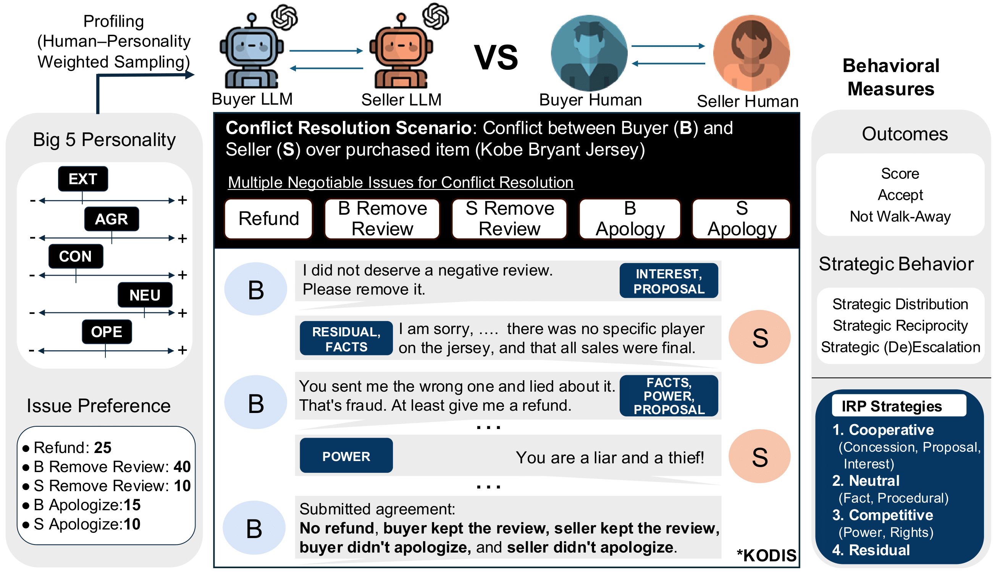

# Personality-Grounded Behavioral Alignment of LLMs and Humans in Conflict Dialogue

[](https://aaai.org/conference/aaai/aaai-26/aisi-call/)
[](https://www.python.org/downloads/)

This repository contains the official implementation of our **AAAI-2026 paper** on **personality-driven behavioral alignment in conflict dialogue**, providing code and evaluation scripts to compare Big Five–prompted LLM agents with humans in dispute resolution conversations.

## 📄 Paper Information

**Title:** [Can LLMs Truly Embody Human Personality? Analyzing AI and Human Behavior Alignment in Dispute Resolution](TBD)

**Authors:** Deuksin Kwon, Kaleen Shrestha, Spencer Lin, James Hale, Jonathan Gratch, Maja Matarić, Gale Lucas

**\[Conference\]** AAAI 2026: Special Track on Artificial Intelligence for Social Impact (AISI)
---
<div align="center">

</div>

## Abstract

Large language models (LLMs) are increasingly used to simulate human behavior in social settings such as legal mediation, negotiation, and dispute resolution. However, it remains unclear if LLMs simulating human behavior are consistent with theoretically proposed mechanisms. Human personality, for instance, may shape how individuals navigate social interactions, including strategic choices and behaviors in emotionally charged interactions. This raises a critical question: \textit{Can LLMs, when prompted with personality traits, reproduce personality-driven differences in human conflict behavior?} To explore this, we introduce an evaluation framework that enables direct comparison of human-human and LLM-LLM behaviors in dispute resolution dialogues with respect to Big Five Inventory (BFI) personality traits. This framework introduces a set of interpretable metrics related to strategic behavior and conflict outcomes. We additionally contribute a novel dataset creation methodology for LLM dispute resolution dialogs with matched scenarios and personality traits with respect to human conversations. Finally, we demonstrate the usage of our evaluation framework with three contemporary closed-source LLMs and show significant divergences in how personality manifests in conflict across different LLMs compared to human data, challenging the assumption that personality-prompted agents can serve as reliable behavioral proxies in socially impactful applications. Our work highlights the need for psychological grounding and rigorous validation in AI simulations before real-world use.

---
## Supplementary Materials of the Paper
You can download the supplementary materials here:
  [Download Supplementary Materials](resources/AAAI_2026_Supplementary_Material.pdf)

---

## Quick Start

This repository provides tools for:
1. **L2L Simulation**: Run LLM-vs-LLM dispute resolution simulations
2. **IRP Annotation**: Annotate conversations with Interest-Rights-Power strategies
3. **Behavioral Analysis**: Analyze outcomes (score, accept_first, walk_away)
4. **Strategic Analysis**: Analyze IRP strategy patterns and interactions

### 1. Run L2L Agent Simulations

```bash
# Run simulation with a specific LLM engine
bash scripts/run_with_engine.sh

# Data will be saved to: data/simulations/{model}.json
```

### 2. IRP Annotation

```bash
# Batch annotation (recommended)
bash scripts/annotate_irp_batch.sh

# Or annotate a single model
python scripts/annotate_irp.py \
    --input data/simulations/gpt-4o-mini.json \
    --data-type model

# Output: data/simulations/{model}_irp.json (auto-merged)
```

### 3. Behavioral Outcomes Analysis

Analyze how personality traits affect behavioral outcomes (negotiation score, first acceptance, walking away).

```bash
# KODIS human data analysis
python scripts/analyze_behavioral_outcomes.py \
    --input data/KODIS/KODIS_H2H_processed.csv \
    --output-dir output/regression

# L2L model data analysis
python scripts/analyze_behavioral_outcomes.py \
    --input data/simulations/gpt-4o-mini_irp.json \
    --output-dir output/regression
```

**Output:**
- `regression_{model_name}_summary.csv`: Significant variables summary
- `regression_{model_name}_full_results.csv`: Full regression coefficients

### 4. Strategic Outcomes Analysis

Analyze IRP strategy patterns (ratios, reciprocity, escalation/descalation).

```bash
# L2L model data
python scripts/analyze_strategic_outcomes.py \
    --input data/simulations/gpt-4o-mini_irp.json \
    --output-dir output/regression

# KODIS human data (requires IRP annotations)
python scripts/analyze_strategic_outcomes.py \
    --input data/KODIS/KODIS-human-human-subset.csv \
    --irp-annotations data/KODIS/KODIS_20_samples_irp.json \
    --output-dir output/regression
```

**Output:**
- `strategic_outcomes_{model_name}_summary.csv`: Significant variables summary
- `strategic_outcomes_{model_name}_full.csv`: Full regression coefficients

---

## Project Structure

```
Personality-LLM-BehavAlign-Dispute/
├── data/
│   ├── KODIS/                    # Human-human negotiation data
│   │   ├── KODIS-human-human-subset.csv
│   │   ├── KODIS_20_samples_irp.json
│   │   └── KODIS_H2H_processed.csv
│   ├── IRP_Annotation/           # IRP annotation storage
│   └── simulations/              # L2L simulation results
├── scripts/
│   ├── run_with_engine.sh       # Run L2L simulations
│   ├── annotate_irp.py          # IRP annotation script
│   ├── annotate_irp_batch.sh    # Batch IRP annotation
│   ├── analyze_behavioral_outcomes.py   # Behavioral analysis
│   ├── analyze_strategic_outcomes.py    # Strategic analysis
│   ├── prepare_kodis_data.py    # KODIS data preprocessing
│   └── merge_irp.py             # Merge IRP annotations
├── output/
│   └── regression/              # Analysis results
└── prompts/                     # LLM prompts for simulations
```

---

## Contact

For questions or issues:
- **GitHub Issues**: Report bugs or feature requests
- **Email**: deuksink@usc.edu (Brian Deuksin Kwon) / kshresth@usc.edu (Kaleen Shrestha)

---

## License
This project is licensed under the MIT License.
